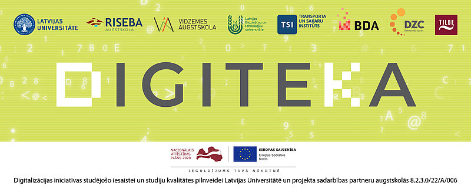

# ca-bot-data

## Acknowledgements

Latvijas Universitāte, sadarbojoties ar Latvijas Biozinātņu un tehnoloģiju  universitāti, Vidzemes augstskolu, Biznesa, mākslas un tehnoloģiju augstskolu RISEBA, 
Transporta un sakaru institūtu un trim nozares partneriem – Tilde, Baltijas datoru akadēmija un Datorzinību centrs, īsteno projektu 
“Digitalizācijas iniciatīvas studējošo iesaistei un studiju kvalitātes pilnveidei Latvijas Universitātē un projekta sadarbības partneru augstskolās” (Nr. 8.2.3.0/22/A/006), 
kura mērķis ir sagatavot digitālos studiju kursu materiālus, lai veicinātu studentu digitālo prasmju attīstību.

Projektu līdzfinansē REACT-EU finansējums pandēmijas krīzes seku mazināšanai.  

[Dataset for Virtual Assistant Digne](https://www.lumic.lu.lv/noderigi/digiteka/) © 2023 by [Tilde](https://tilde.ai) is licensed under [CC BY-NC-ND 4.0](https://creativecommons.org/licenses/by-nc-nd/4.0/)
